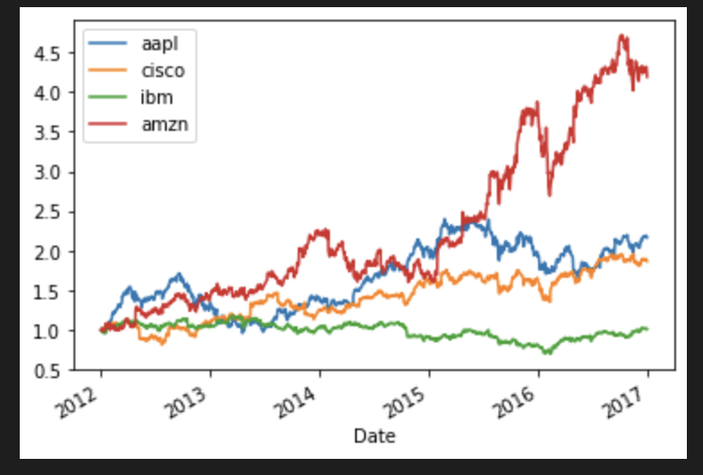
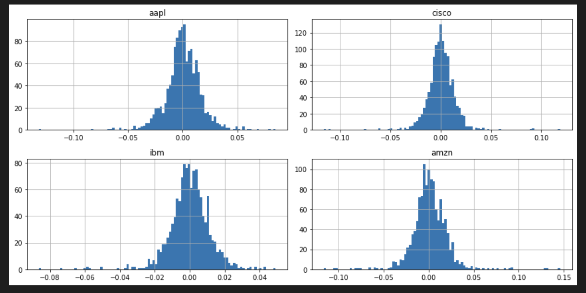
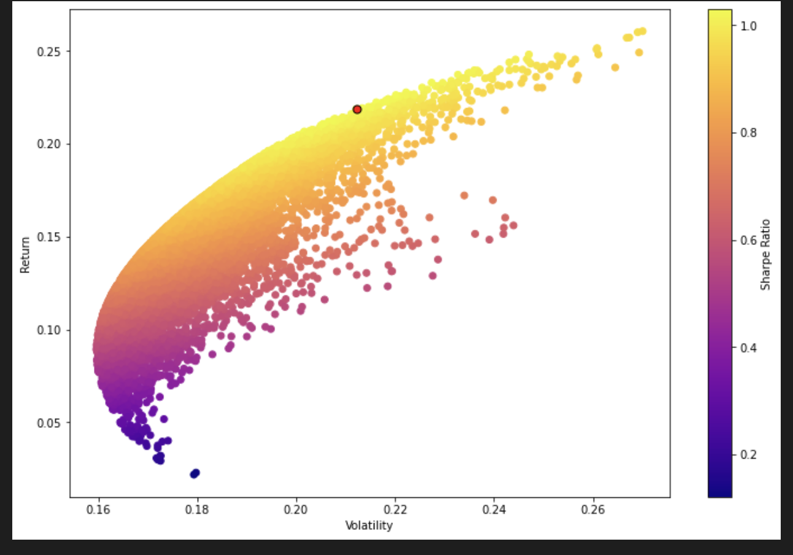
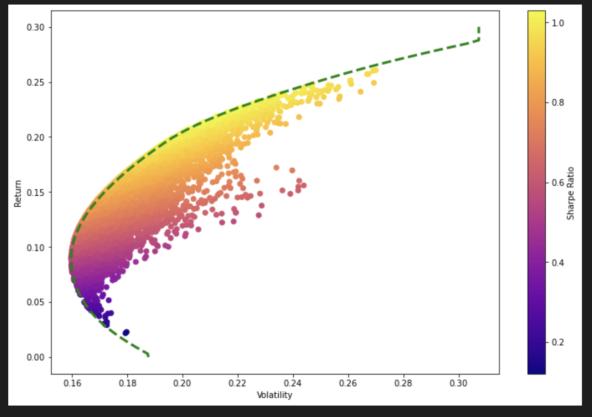

# Equities-Portfolio-Optimization
Equities Portfolio Optimization based on Markowitz Portfolio Theory implemented using monte carlo simulations, calculation of sharpe ratio and plotting of the efficient frontier

## [Notebook Here](https://github.com/SZun/Equities-Portfolio-Optimization/blob/main/Portfolio-Optimization.ipynb)

## Images from Notebook






## Getting Started

### Prerequisites

You must have anaconda and conda installed

```
$ anaconda --version
```
*# OUTPUT: "anaconda Command line client (version 1.11.0)"*
```
$ conda --verison
```
*# OUTPUT: "conda 22.9.0"*


### Installing

**Clone** the repo using SSH

```
$ git clone git@github.com:SZun/Equities-Portfolio-Optimization
```

Then **cd** into the directory

```
$ cd Equities-Portfolio-Optimization
```

Create the environment, add it to jupyter and launch jupyter lab

```
$ conda env create -f dev.yml
$ jupyter kernelspec remove ENVIRONMENT_1_NAME ENVIRONMENT_2_NAME
$ conda install -c conda-forge nb_conda_kernels -y
$ jupyter lab
```

## Built With

- [Pandas](https://pandas.pydata.org/docs/#)
- [Numpy](https://numpy.org/)
- [Matplotlib](https://matplotlib.org/stable/index.html)

## Author

**Samuel Zun** 
- [LinkedIn](https://www.linkedin.com/in/szun/) | [Github](https://github.com/SZun)